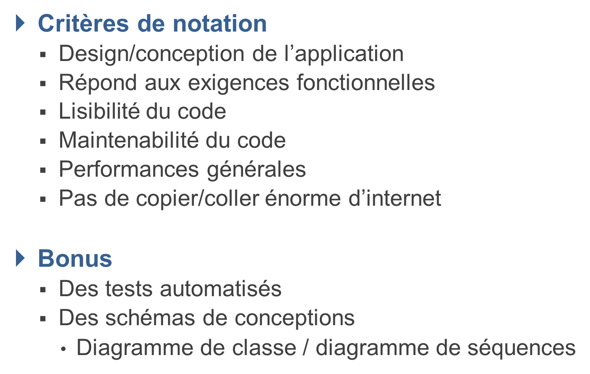
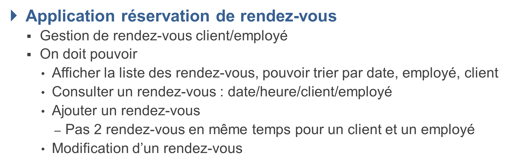

# Subject : TODO


## TODO


## Prérequis

    Java 11 ou supérieur
    Maven
    H2 Database

## Comment démarrer

    Clonez le répos GitHub

```bash
git clone https://github.com/Cliffy57/3A_Projet_SystServeur-_S6_2023-.git
```

    Importez le projet dans votre IDE préféré (IntelliJ IDEA, Eclipse, NetBeans, etc.)
    Démarrez le projet en exécutant le serveurTomcat 10.1.6

    Importez la base de données

    Vous pouvez importer la base de données à partir des 3 fichiers .sql inclus dans le projet.

    Configurer le fichier hibernate.cfg.xml

    Mettez à jour le fichier hibernate.cfg.xml dans le répertoire src/main/resources avec les informations de votre base de données.

## PROBLEMES

c'est ca qui créer l'erreur : <%@ taglib prefix="c" uri="http://java.sun.com/jsp/jstl/core" %> dans les jsp l'usage 
de jstl provoque une erreur : Type Rapport d'exception

message java.lang.NoClassDefFoundError: javax/servlet/jsp/tagext/TagLibraryValidator

description Le serveur a rencontré une erreur interne qui l'a empêché de satisfaire la requête.

exception jakarta.servlet.ServletException: java.lang.NoClassDefFoundError: javax/servlet/jsp/tagext/TagLibraryValidator
org.apache.jasper.servlet.JspServlet.service(JspServlet.java:333)
jakarta.servlet.http.HttpServlet.service(HttpServlet.java:631)
org.apache.tomcat.websocket.server.WsFilter.doFilter(WsFilter.java:53)

## DIAGRAMME DE CLASSE


## AMELIORATIONS

Diagramme de sequence

https://www.thymeleaf.org/ 
