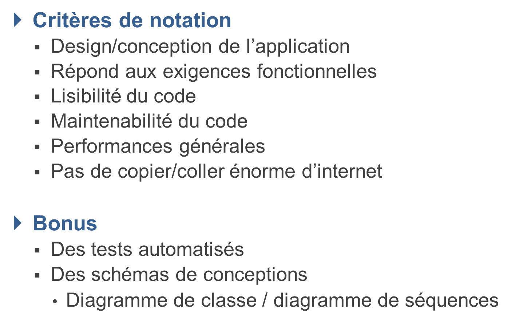
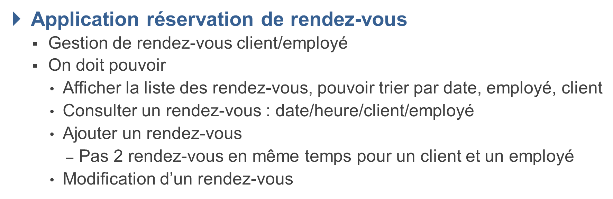

# Subject : TODO

## TODO

## Notes
Faire Hibernate pour joindre les classes a la db H2, rewrite les classes avec les annotations hibernate

Faire des pages pour test si ca fonctionne

Servlets : Vous aurez besoin d'au moins une servlet pour gérer les demandes HTTP. Cependant, vous pouvez en avoir plusieurs pour gérer différents types d'actions. Par exemple, une servlet pour afficher la liste des rendez-vous, une autre pour ajouter un rendez-vous, une autre pour modifier un rendez-vous, etc. En fonction de la complexité de l'application, vous pouvez vous retrouver avec entre 3 et 8 servlets.

JSP : Vous aurez besoin d'au moins une JSP pour afficher le contenu de l'application. Cependant, vous pouvez en avoir plusieurs pour afficher différents types d'informations. Par exemple, une JSP pour afficher la liste des rendez-vous, une autre pour ajouter un rendez-vous, une autre pour modifier un rendez-vous, etc. En fonction de la complexité de l'application, vous pouvez vous retrouver avec entre 3 et 8 JSP.